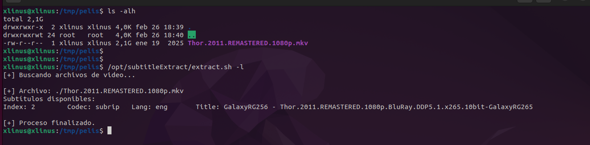
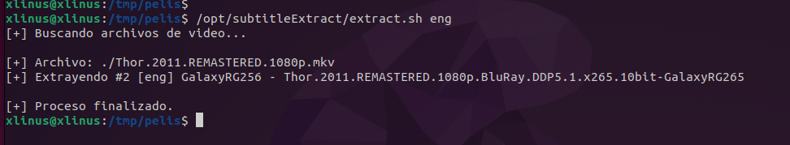
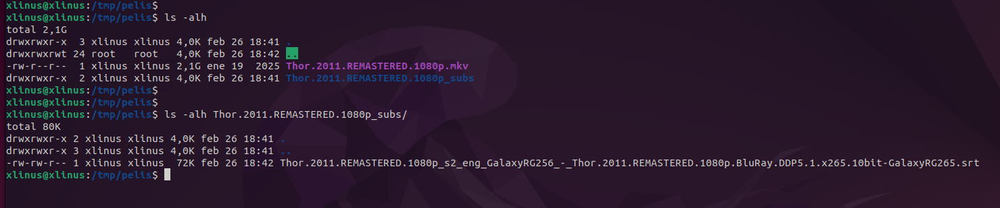

# subtitle Extract
### Extrae los subtitulos adjuntos en un archivo de video

```
$ sudo apt install ffmpeg jq findutils
```

```
$ ./extractSubtitle.sh -l
```



```
$ ./extractSubtitle.sh eng 
```




