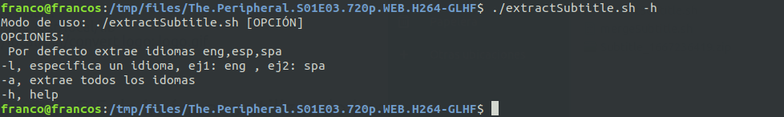
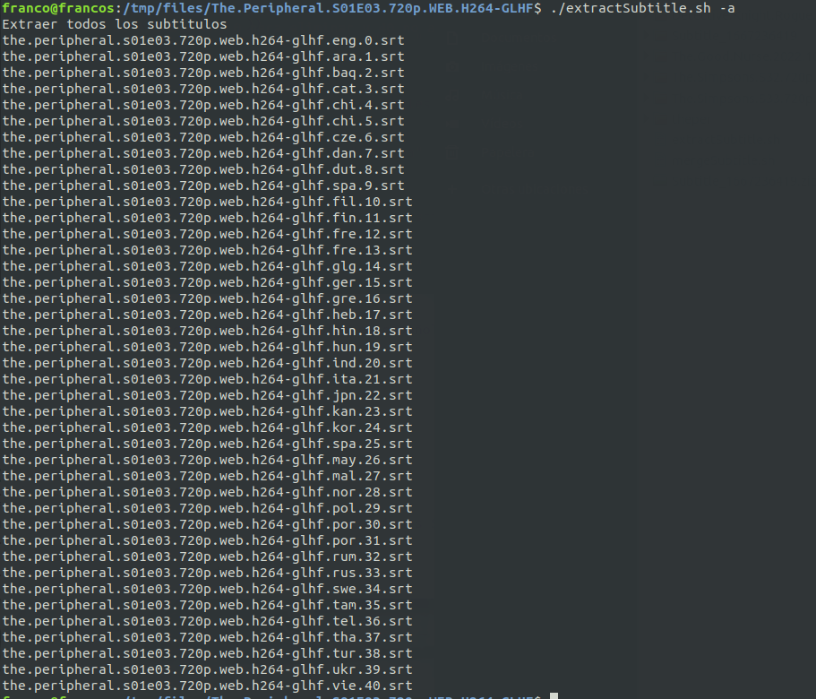

# subtitle Extract
### Extrae los subtitulos adjuntos en un archivo de video


```
$ sudo snap install ffmpeg -y 
```


```
$ ./extractSubtitle.sh -h
```


```
$ ./extractSubtitle.sh 
```
s


```
$ ./extractSubtitle.sh -a
```


